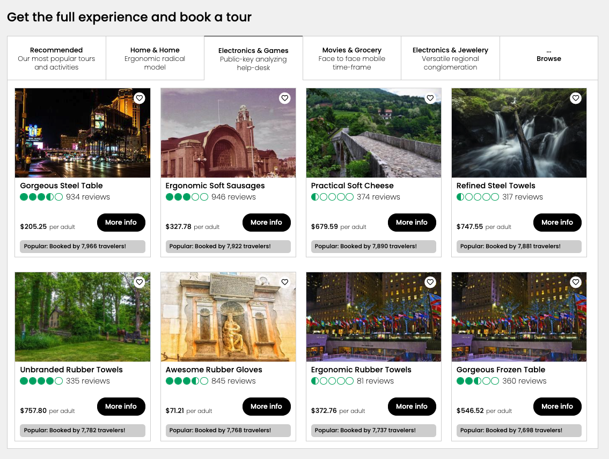
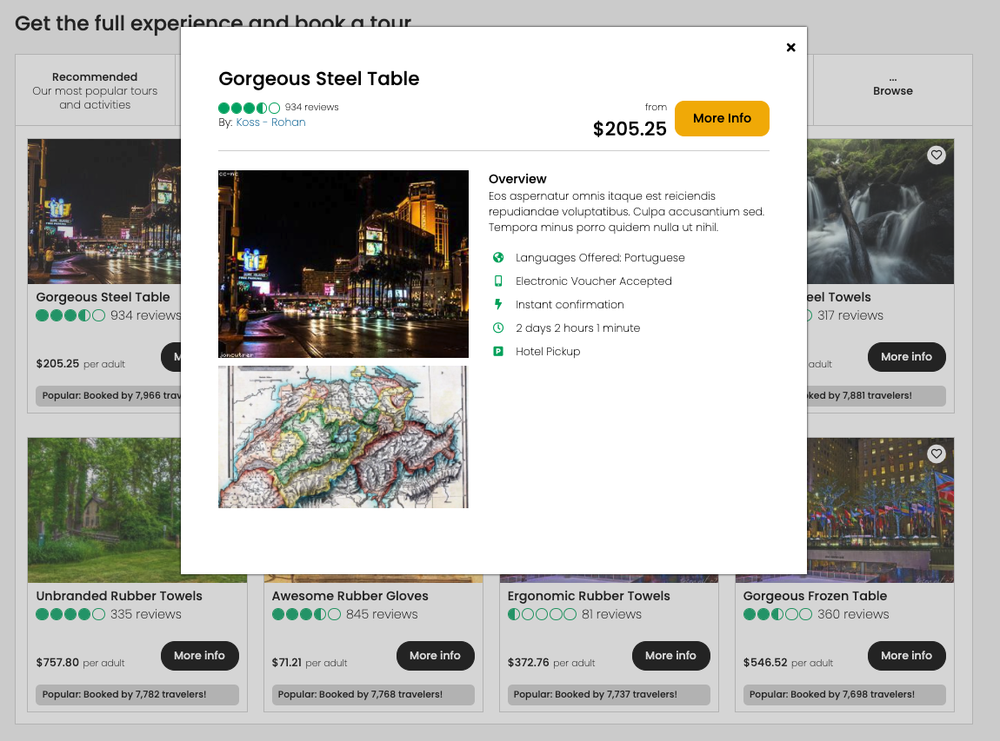

<!-- TABLE OF CONTENTS -->
<details open="open">
  <summary>Table of Contents</summary>
  <ol>
    <li>
      <a href="#about-the-project">About The Project</a>
      <ul>
       <li><a href="#demo">Demo</a></li>
       <li><a href="#built-with">Built With</a></li>
      </ul>
    </li>
    <li>
      <a href="#getting-started">Getting Started</a>
      <ul>
        <li><a href="#prerequisites">Prerequisites</a></li>
        <li><a href="#installation-and-starting-the-project">Installation</a></li>
        <li><a href="#view-testing-suite">Test Suite</a></li>
      </ul>
    </li>
    <li><a href="#contact">Contact</a></li>
  </ol>
</details>

<!-- About the project -->
## About The Project

In this project, I worked with a team of engineers in designing a complex backend system for a legacy codebase to prepare the service for production level traffic. I worked on scaling the tours component of the service which enabled the user to view the most popular tours for their destination and sort through them with a variety of categories. I have provided screenshots of the legacy front-end to give a better description of the component.

In order to scale the component, I began by performing multiple stress tests to simulate high user traffic using Loader.io and monitored my response information using New Relic. After recording the initial maximum load of the component, I proceeded to horizontally scale my service using an NGINX load balancer and also vertically scale my database. In the end, I was able to increase the servers maximum requests per minute by 760% to 114,000.

Project Link: [https://github.com/trips-ahoy/tours-service](https://github.com/trips-ahoy/tours-service)

<!-- Front End Demo -->
## Front End Demo




<!-- Built With -->
### Built With

* [React](https://reactjs.org)
* [Express](http://expressjs.com/)
* [Axios](https://www.npmjs.com/package/axios)
* [Styled Components](https://styled-components.com/)
* [MongoDB](https://www.mongodb.com/)
* [AWS S3](https://aws.amazon.com/s3/)
* [Jest](https://jestjs.io/)

<!-- GETTING STARTED -->
## Getting Started

To get a local copy up and running follow these simple steps.

<!-- PREREQUISITES -->
### Prerequisites

* npm
  ```sh
  npm install npm@latest -g
  ```
* mongoDB <br/>
  [installation instructions](https://docs.mongodb.com/manual/administration/install-community/)
  
<!-- INSTALLATION -->
### Installation and starting the project

1. Clone the repo and then cd into the repo
   ```sh
   git clone https://github.com/Slam-Dunk-Supplies/gallery.git
   ```
2. Install NPM packages
   ```sh
   npm install
   ```
3. Seed MongoDB database
   ```sh
   npm run seed
   ```
4. Build with Webpack
   ```sh
   npm run build
   ```
5. Run with NPM
   ```sh
   npm start
   ```
6. Go to localhost:3002 on your browser to view the gallery
7. Add a number following to the end of the url (ex: localhost:3002/(some # between 1-100)). To view additional images aside from the default listing id of 1. 

<!-- Testing Suite -->
## View Testing Suite

1. Once installed. Simply run NPM test
   ```sh
   npm test
   ```

<!-- CONTACT -->
## Contact

<!-- LinkedIn Contact -->
<a href="https://www.linkedin.com/in/ecetino/" target="_blank">
  
</a>
  
<!--   Email -->
<a href="mailto:cetino-e@hotmail.com">
  
</a>


