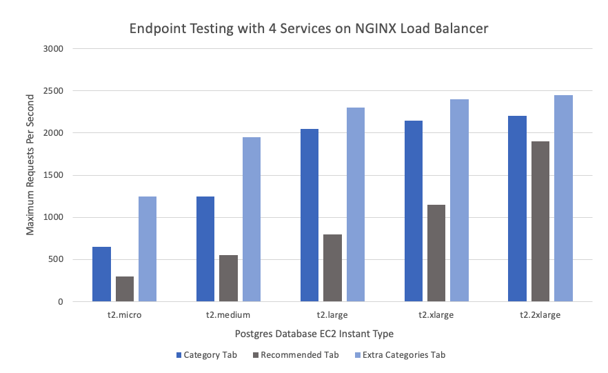

<!-- TABLE OF CONTENTS -->

  
Table of Contents

  <ol>
    <li>
      <a href="#about-the-project">About The Project</a>
      <ul>
       <li><a href="#front-end-demo">Front End Demo</a></li>
       <li><a href="#related-projects">Related Projects</a></li>      
      </ul>
    </li>
    <li>
      <a href="#Designing-the-backend">Designing The Backend</a>
      <ul>
        <li><a href="#stress-tested-and-scaled-with">Stress Tested And Scaled With</a></li>
        <li><a href="#dataset-breakdown">Dataset Breakdown</a></li>        
        <li><a href="#choosing-a-database">Choosing A Database</a></li>
        <li><a href="#stress-testing-and-scaling-deployed-service">Stress Testing And Scaling Deployed Service</a></li>
      </ul>
    </li>
    <li><a href="#results">Results</a></li> 
    <li><a href="#contact">Contact</a></li>
  </ol>

<!-- About the project -->
## About The Project

In this project, I worked with a team of engineers in designing a complex backend system for a legacy codebase to prepare the service for production level traffic. I worked on scaling the tours component of the service which enabled the user to view the most popular tours for their destination and sort through them with a variety of categories. I have provided a demo of the legacy front-end to give a better description of the component. As I was working with the backend, the folders I did the majority of the work in are in the database, dataGen, server, and some work on the client with small front-end refactors. 

In order to scale the component, I began by performing multiple stress tests to simulate high user traffic using Loader.io and monitored my response information using New Relic. After recording the initial maximum load of the component, I proceeded to horizontally scale my service using an NGINX load balancer and also vertically scale my database. In the end, I was able to increase the servers maximum requests per minute by 760% to 114,000. My methods for this are explained in greater detail in the Designing The Backend section.

Project Link: [https://github.com/trips-ahoy/tours-service](https://github.com/trips-ahoy/tours-service)

<!-- Front End Demo -->
### Front End Demo

<!-- Related Projects -->
### Related Projects

* [Trips Ahoy Q&A](https://github.com/trips-ahoy/qa)
* [Trips Ahoy Reviews](https://github.com/trips-ahoy/reviews_service)
* [Trips Ahoy Gallery](https://github.com/trips-ahoy/topdescription-service)

<!-- Designing the Backend -->
## Designing the Backend

<!-- Stress Tested And Scaled With -->
### Stress Tested And Scaled With

* [PostgresSQL](https://www.postgresql.org/)
* [New Relic](https://newrelic.com/)
* [Loader.io](https://loader.io/)
* [NGINX Load Balancer](https://www.nginx.com/?_ga=2.158389434.1677834339.1611021376-367796849.1611021376)
* [AWS EC2](https://aws.amazon.com/ec2/?ec2-whats-new.sort-by=item.additionalFields.postDateTime&ec2-whats-new.sort-order=desc)

<!-- Choosing A Database -->
### Choosing A Database

In choosing a database for my component, scalability was very important and with this consideration in mind, I narrowed my choices to two databases a SQL database (Postgres) and a NOSQL database (Cassandra). In order to decide between the two, I proceeded to benchmark the two databases once they were seeded with the 10 million database entries and recorded the average non-cached response time at each of the 3 endpoints at a given listing ID. These listing IDs were distributed evenly throughout the dataset with 5 tested each at the first 10%, middle 10%, and last 10% portion of the dataset per endpoint for each database. Results are shown in the table below. 

  
  <h6 align="center">Table 1. Database Benchmark </h6>

My results for the benchmark favored postgres and this was most likely due to relational nature of the queries I performed (describe in Dataset Breakdown). In postgres I was able to perform one complex query to get the data needed but this was not possible with a single query for cassandra and requried 2 separate queries to get all the information I needed. Looking at how both databases scale, Cassandra is a great option as it was built with scalability in mind but Postgres is a good option too with it's streaming replication feature which spreads queries to multiple read only replicas and since my endpoints are all get request and not post requests this is a good option as well. In the end, I choose to go with Postgres because of its better reponse time and because it could scale easily.

<!-- Dataset Breakdown -->
### Dataset Breakdown

In the dataset, there are 10 million records that contain the tour information for the site. This information is spread out into 5 relational tables like so:

* Listings Table: Contains 10 million listing IDs and the location ID assoicated to that listing ID
* Locations Table: Contains 1000 Location IDs 
* Categories Table: Contains 30 category IDs and the category information associated to that category ID (i.e. name, location ID)
* Location-Categories Table: Contains relation of which category IDs are available at a given Location ID
* Tours Table: Contains 10 million tours and the tours information associated to that tour (i.e. category ID, location ID)

  
  <h6 align="center">Table 2. Postgres Schema </h6>

The relation of the the data is as follows:
* Each listing ID has 1 location ID
* Each location ID has 11-16 category IDs assigned to it
* Each category ID has many tours associated to it
* Each tour has 1 location ID and 1 category ID 

<!-- Stress Testing And Scaling Deployed Service -->
### Stress Testing And Scaling Deployed Service

  
  <h6 align="center">Table 3. Server Structure</h6>

  
  <h6 align="center">Table 4. Horizontally Scaling Service Using Load Balancer </h6>
  

  
  <h6 align="center">Table 5. Vertically Scaling Database By Changing EC2 Instance Type</h6>

<!-- Results -->
## Results

<!-- CONTACT -->
## Contact

<!-- LinkedIn Contact -->

  
<!--   Email -->

